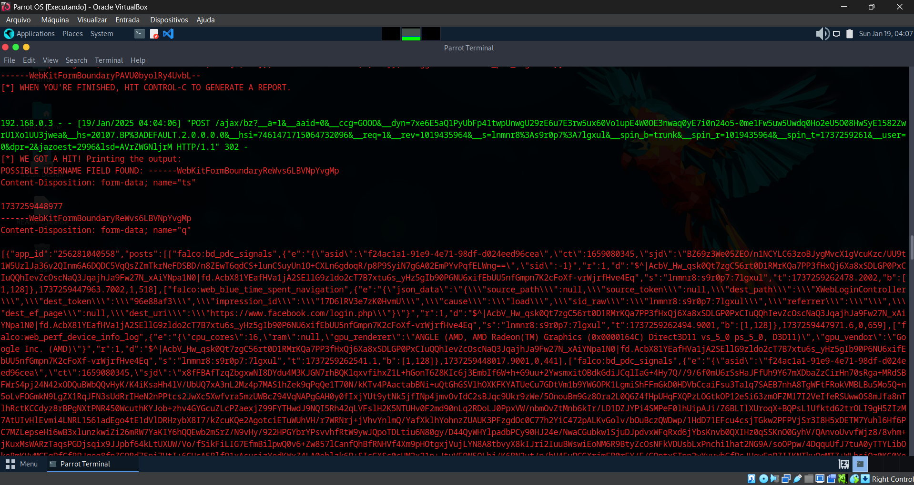
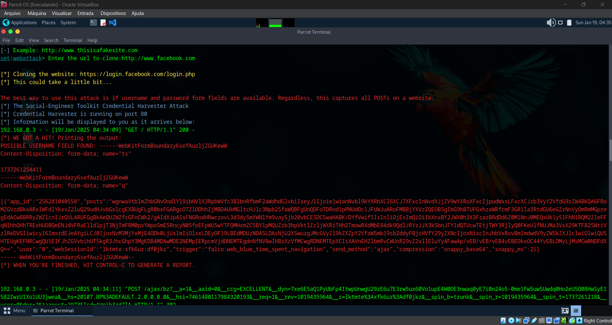

# Phishing para captura de senhas do Facebook

### Ferramentas

- Oracle Virtual Box
- Parrot Os
- setoolkit
- Configurar a rede da Vm para o modo Brigde

---
#### Obs: Nos dois teste feitos o site do facebook utilizou uma proteção em seu formulário deixando ilégivel o nome de usuário e a senha, retornando um webkit.
---
### Configurando o Phishing no Parrot Os - teste usando "https" no clone

- Acesso root: ``` sudo su ```
- Iniciando o setoolkit: ``` setoolkit ```
- Tipo de ataque: ``` Social-Engineering Attacks ```
- Vetor de ataque: ``` Web Site Attack Vectors ```
- Método de ataque: ```Credential Harvester Attack Method ```
- Método de ataque: ``` Site Cloner ```
- Obtendo o endereço da máquina: ``` ifconfig ```
- URL para clone: http://www.facebook.com

### Resutados



### Configurando o Phishing no Parrot Os - teste usando "http" no clone

- Acesso root: ``` sudo su ```
- Iniciando o setoolkit: ``` setoolkit ```
- Tipo de ataque: ``` Social-Engineering Attacks ```
- Vetor de ataque: ``` Web Site Attack Vectors ```
- Método de ataque: ```Credential Harvester Attack Method ```
- Método de ataque: ``` Site Cloner ```
- Obtendo o endereço da máquina: ``` ifconfig ```
- URL para clone: http://www.facebook.com

### Resutados

